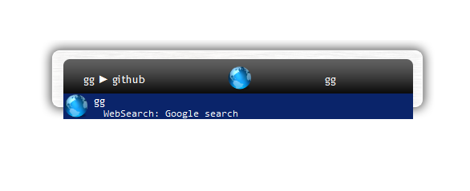
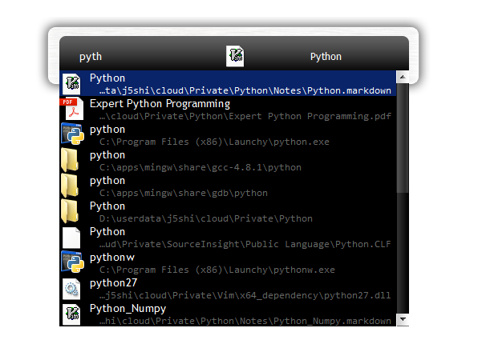

# Thruster

[Launchy](http://www.launchy.net/) is a free utility designed to help you forget about your start
menu, your desktop icons, and your file manager. Launchy indexes and launches your applications,
documents, project files, folders, and bookmarks with just a few keystrokes!

**Thruster** is an _all in one_ plugin for Launchy, you don't need any other launchy plugins
anymore, I say this because it is true: Thruster is written in Python and Python is simple and
flexible, when ideas come to your mind but not available in Launchy, just extend **Thruster.py** by
yourself or send me an request.

## Installation

Thruster is available on Windows only.

```cmd
# Run installer.bat
~> installer.bat
```

**Note: You may need to quit Launchy before installation if a Launchy instance is currently running
on your system.**

## Features

### Search Bookmarks

<p align="center"> 

</p>

Index your browser bookmarks and launch them in Launchy.

After installation, restart Launchy and rebuild catalog, now you will be able to find and launch
your bookmarks in Launchy.

**Note: Google Chrome is currently the only browser that is supported, but it's quite easy to extend
to other browsers.**

### Web Search

<p align="center"> 

</p>

There are some search engines already integrated with Thruster, to start searching, type the search
engine keywords to select the search engine and then type the words to search.

Search Engine Keywords | Search Engine
---                    | ---
gg                     | Google
ii                     | Bing
bb                     | Baidu
so                     | Stackoverflow
ieee                   | ieeexplore
gmap                   | Google Map
bmap                   | Baidu Map
tao                    | Taobao
jd                     | Jingdong

<<<<<<< HEAD
### Shortcuts Support
=======
### Shortcut Support
>>>>>>> 95d116448fb8436f97006548d9cc0249aaf2a252

<p align="center"> 

</p>

Some shortcuts are pre-defined.

Shortcuts | Description
---       | ---
<<<<<<< HEAD
"S-Enter" | Open the select file/directory in TotalCommander right panel
"C-Enter" | Open the select file/directory in TotalCommander left panel
"M-Enter" | Open the select file in gvim.exe
=======
<S-Enter> | Open the select file/directory in TotalCommander right panel
<C-Enter> | Open the select file/directory in TotalCommander left panel
<M-Enter> | Open the select file in gvim.exe
>>>>>>> 95d116448fb8436f97006548d9cc0249aaf2a252

> TotalCommander and gvim should be in OS searching path.

