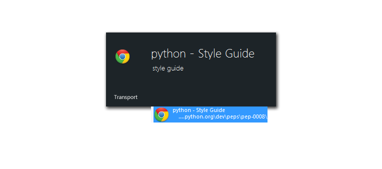
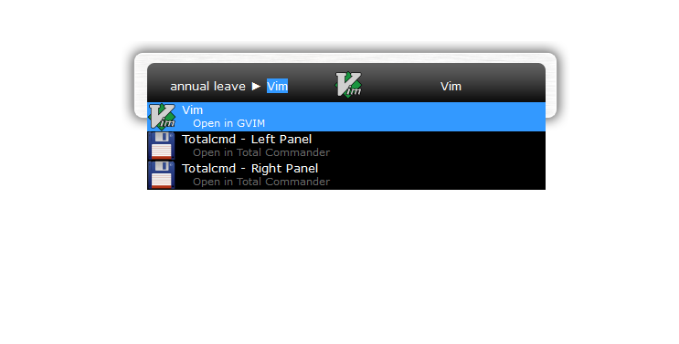

# Thruster

[Launchy](http://www.launchy.net/) is a free utility designed to help you forget about your start menu, your desktop icons, and your file manager. Launchy indexes and launches your applications, documents, project files, folders, and bookmarks with just a few keystrokes!

Thruster is an all in one plugin for Launchy, you don't need any other launchy plugins anymore, I say this because it is true: Thruster is written in Python and Python is simple and flexible, when some ideas come to your mind but not available in Launchy, just extend Thruster by yourself or send me an request.

## Installation

```cmd
# Run installer.bat
~> installer.bat
```

**Note: You may need to quit Launchy before installation if a Launchy instance is currently running on your system.**

## Features

### Index Chrome Bookmarks



Index your browser bookmarks and launch them in Launchy.

After installation, restart Launchy and rebuild catalog, now you will be able to find and launch your bookmarks in Launchy.

**Note: Google Chrome is currently the only browser that is supported, but it's quite easy to extend to other browsers.**

### Open in Customized Program



Thruster allows you to customize operations for a certain type of file, for example, you can define operations for a text file like: "open in Total Commander", "open in Vim", "open in ... whatever".

And shortcut is supported, for instance: `<C-Enter>` and `<S-Enter>` for open files in Total Commander left and right panel.

### Web Search

Do the web search in Launchy, this features is quite the same as the Launchy build-in plugin `weby`, but it's integrated in Thruster.

### Customized Commands

Define aliases for commands (DOS, BASH, ...) or define a command for a python function, very useful.
